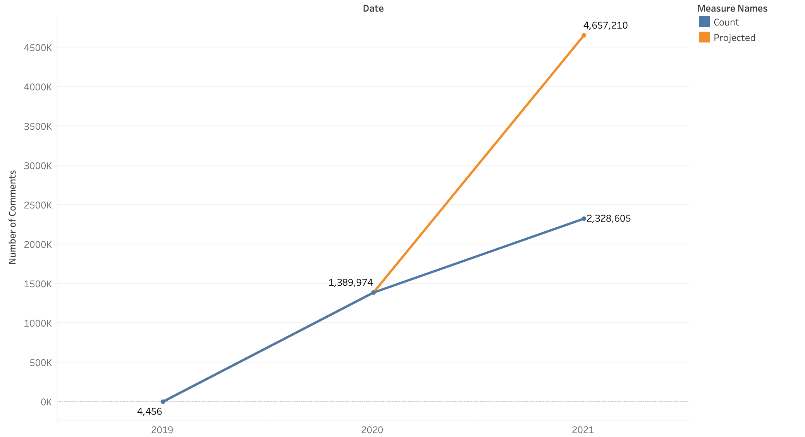
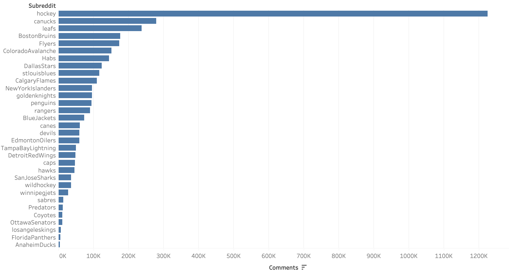
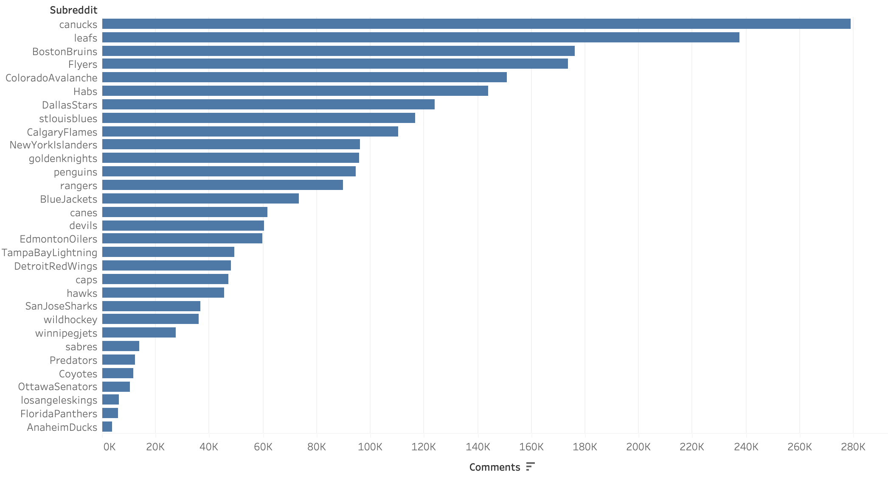
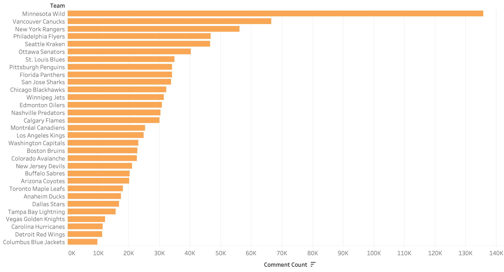
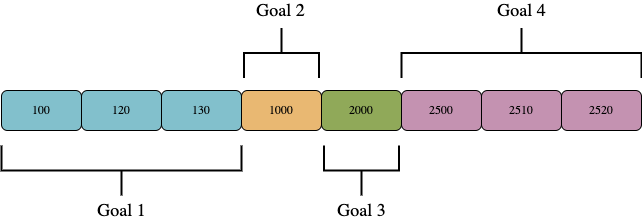
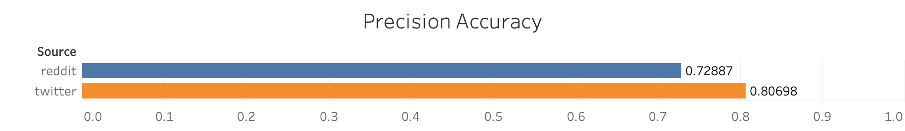
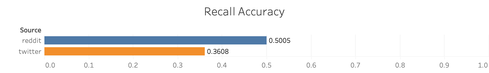

## NHL Event Detection Project

The project aims to understand how well can human sensors on a large-scale microblogging platform be utilized to detect and report high frequency less significant (HFLS) events such as game events occurring during a nationally broadcasted sports tournament like National Hockey League (NHL). This project envisions providing a proof-of-concept to detect more pressing HFLS events such as plea calls during a regional natural disaster or traffic accidents. 

The problem at hand is occupied with two major challenges - 
- to fetch and associate relevant tweets (or comments) to respective games from a vast pool of available microblogging data
- to process high-frequency incoming tweets (or comments) without significant delay

The approach adopted to address the problem leverages key sensing properties of human sensors like post rate and incorporates adaptive sliding windows to mitigate detection delays. 

This project is limited to detecting two major buckets of events - goals and not goals due to the high occurrence of these events in a hockey game.

### Presentation

My groupmates and I put together a video explaining the project in some more detail.

- [Event Detection Presentation (Youtube)](https://www.youtube.com/watch?v=AGMcEMRGVVA)

### Data Collection + ETL

Three data sources for the project.

- Reddit Corpus Dataset (~500GB)
- Scraped Twitter Data (~50GB)
- NHL API (~2GB)

The data sets required extensive cleaning and engineering to get them into a usable format.

### Reddit Data

Reddit has subreddits for every NHL team and a general hockey subreddit. Game threads are a relatively new component of these subreddits, and we were only able to use comment data from 2020 onwards. You can see from the following plot how many comments are made each year in game threads. Since we are only working with Reddit data for the first 6 months of 2021, we included the projected number of comments that we expect for the whole year. 

Furthermore, we can also see the comment activity in each subreddit.

We can see that the highest activity is in the "hockey" subreddit thread. This would make sense as there are threads for every game here whereas the individual subreddits only have game threads for their games. When we remove the hockey subreddit from the plot we can see the activity of the team's fanbase during games on Reddit. Some teams did not adopt game threads until mid-way through 2020 and others do not have as big a following as other teams. We can see that the Vancouver Canucks have a very active fanbase on Reddit, whereas the Anaheim Ducks fans are the least active during games.

 
### Twitter Data

Twitter was slightly different than the Reddit data. We had to acquire game tweets by hashtags and mentions in the actual tweets. This meant that the data acquired may not represent the entirety of users commenting during games, and the representation of the data is somewhat skewed by the methodology of our filtering process. That being said, we were still able to acquire a large number of tweets for each team. Based on our results the most active fans were supporters of the Minnesota Wild, and the least active fanbase was that of the Columbus Blue Jackets. 

### NHL API Data

The NHL API was extremely comprehensive and provided much more information than we expected. Given the complexity of this data, many really interesting projects can branch from this source.

In our case, we only needed the start time and end time of games, and the time at which goals occurred in the match. Here is a sample of some data that is returned from a goal event in JSON format. Note that the event code is a unique identifier which is the gateway to even more information on this event.

### Event Detection

For the event detection component, we used a sliding window method to determine if an event occurred. In each window, an event was detected if the post rate exceeded 1 post per second, and there was more comment activity in the second part of the window than in the first. After testing window sizes of 6, 10, 20, 30, and 60 seconds, we found that 20-60 second windows worked the best.

### Event Classification

The event classification step was focused on using lexicon-based methods and clustering to predict whether events were related to a goal or not. Some of the lexicons that we used were "goal", "score", "lead", "net", "assist", "play", "pass". If a comment contained any one of these lexicons, then we labeled this comment as related to a goal. If the number average number of comments in a given window exceeded a certain threshold then we classified the mid-point of the window as the time of the goal.

Initially, we had many windows that were predicting the same goal. This was problematic and we decided to implement a simple clustering algorithm to solve this problem. Traversing a sorted list of predicted goals during a match, predictions were clustered together if they fell within 30 seconds of their nearest neighbor. Using the earliest and latest timestamp in the cluster, we took the average of these two values and used this as the predicted time of the goal. This clustering step was paramount in increasing the model accuracy and decreasing the runtime of the classification script.

### Results

The resulting accuracy of the model was as follows. For the Reddit comments, we achieve a precision accuracy of 72% and a recall accuracy of 50%. For the Twitter comments, we achieved a precision accuracy of 80% and a recall accuracy of 36%. A prediction was classified as correct if it fell within the second window after a goal occurred. We can see these results in the plots below.

